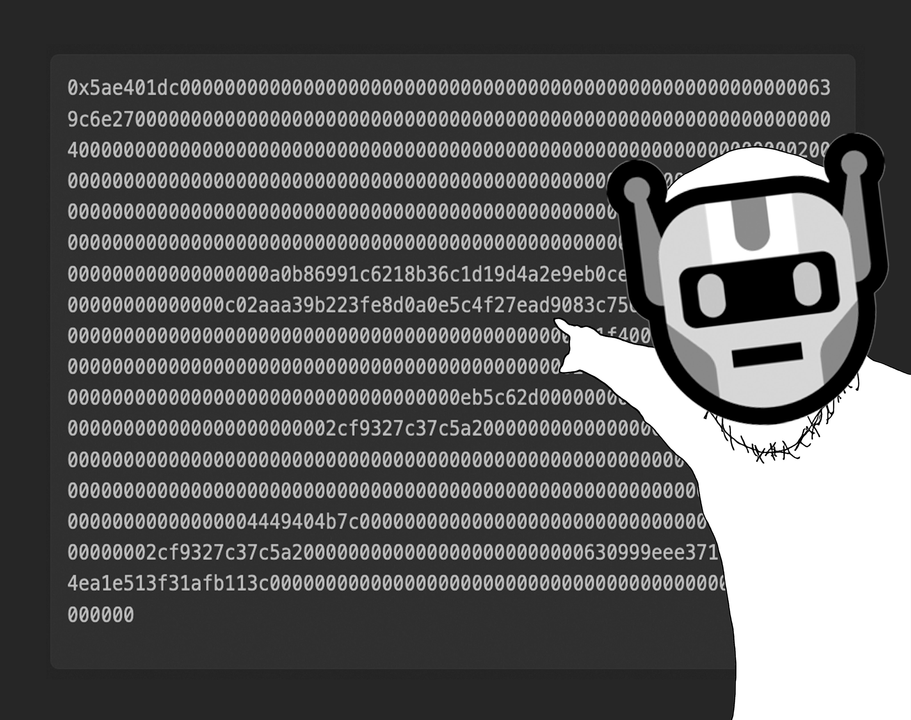
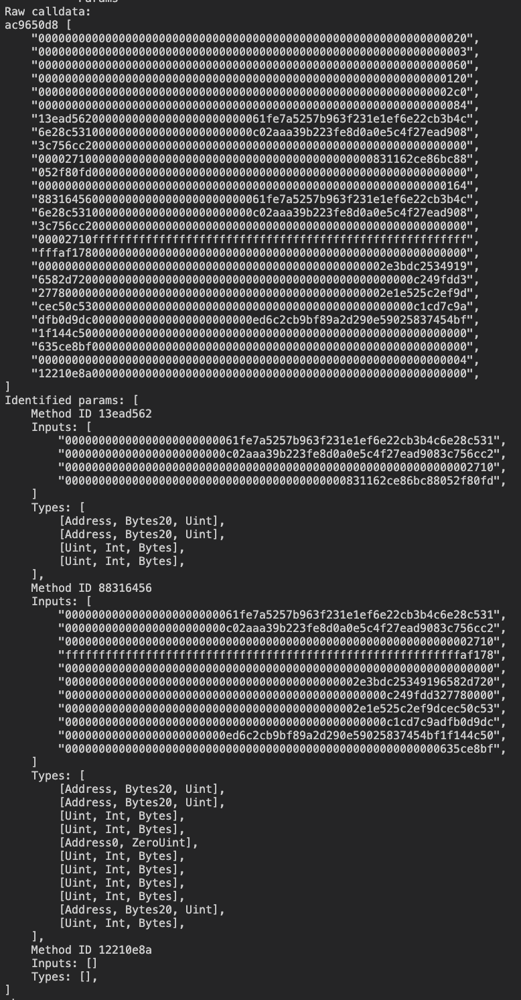

# Calldata Decoder

A program to automate raw calldata decoding using *only* the calldata, discussed in [DeGatchi](https://twitter.com/DeGatchi)'s article, [Reverse The EVM: Raw Calldata](https://degatchi.com/articles/reading-raw-evm-calldata).

---

## Demo

---

## Features

- [x] Selector detector
- [x] Parameter parser
  - [ ] Parameter relation mapping
- [x] Parameter type guesser
  - [ ] For main body
  - [x] Nested (multicall)
  - [ ] Optimised address detector

---

## Todo

### [ ] - Put tests in their own files bc they're so big (to decode the values).

### [ ] - Parameter parser: Parameter relation mapping

> How to implement

If dynamic type:

1. Track offset.
2. Find length from offset.
3. Get values.
4. If values have dynamic types map them to a second branch.
5. Then we can build the potential struct/array used as a param.

### [ ] - Parameter type guesser: For main body

> How to implement

| Value                               | Slot |
| ----------------------------------- | ---- |
| 0xe5                                | 0x20 |
| 0x60 -> start at 0x80 (end of 0x60) | 0x40 |
| 0x01                                | 0x60 |
| 0x02                                | 0x80 |

For `0x60` at `0x40`:

1. Check value above -> Is there a main body param above or is it standalone?
2. Check value below -> Is it the offset? if not its the next main body param.
3. Are there enough bytes to finish the dynamic type?
4. Is there any more params after?

Then we need to create a test for this ^

---

## Contributing

This repo can be expanded to become much more sophisticated. There are some core features missing.

If you feel contributing please feel free to make a pr :)
